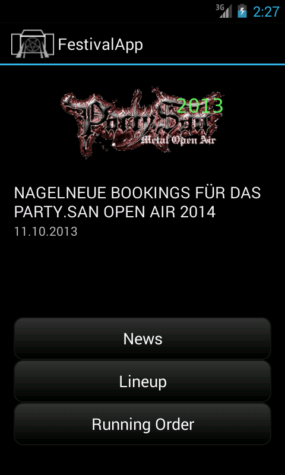

The FestivalApp
======================

FestivalApp is my playground to learn more about Android. It's my first non "hello world" Android App. So, be nice to me :D.

The application idea was born on my last festival visit. 
I needed some background about the next gig to run. The festival guide was 10 minutes away in my car.
So I thought, cool I have my phone with me. However, there was no network connection at all or just a really slow connection ...

Features:
----------

  - offline cache for (heavy metal) festivals
  - news, lineup and running order
  - a private running order, including a timer for the next preferred gig
  - additional information on bands (e.g. band webpage, wikipedia entry, encyclopedia metallum entry)

Requirements:
-------------

You have to install at least one of the festival providers:
  - PartySan 2014 Provider
  - Wacken 2014 Provider

Todo / Next:
-------------

   - Twitter / Facebook integration?
   - Google Maps Integration? 

Screenshots:
------------

