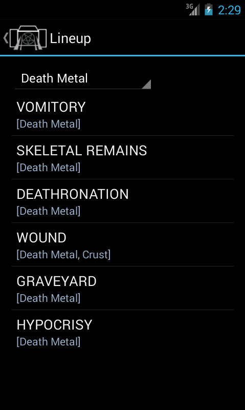
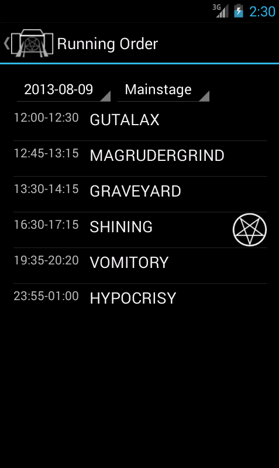
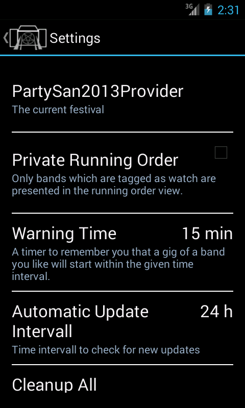
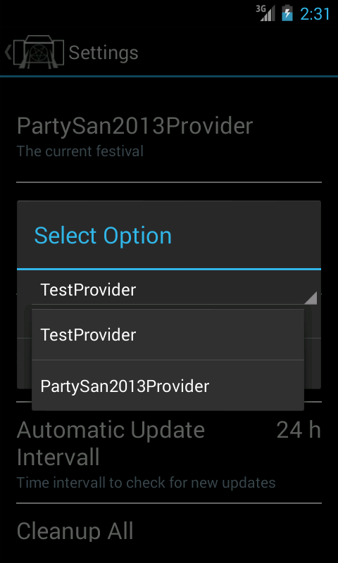

The FestivalApp
======================

FestivalApp is my playground to learn more about Android. Its my first non "hello world" Android App. Be nice to to :D.

The application idea was born from my last festival visit. 
I needed some background to the next band. The festival map was 10 minutes away in my car.
So I thought, cool I have my phoe with me. But: ther ewas no network connection or the network was really slow ...

Features:
----------

  - offline cache for (heavy metal) festivals
  - news, lineup and running order
  - a private running order, including a timer for the next prefered gig
  - additional informations for bands (e.g. bandpage, wikipedia, encyclopedia metallum)

Requirements:
-------------

You have to install at least one of the festival provider:
  - PartySan 2014 Provider
  - Wacken 2014 Provider

Todo / Next:
-------------

   - Twitter / Facebook integration?
   - Google Maps Integration? 

Screenshots:
------------

